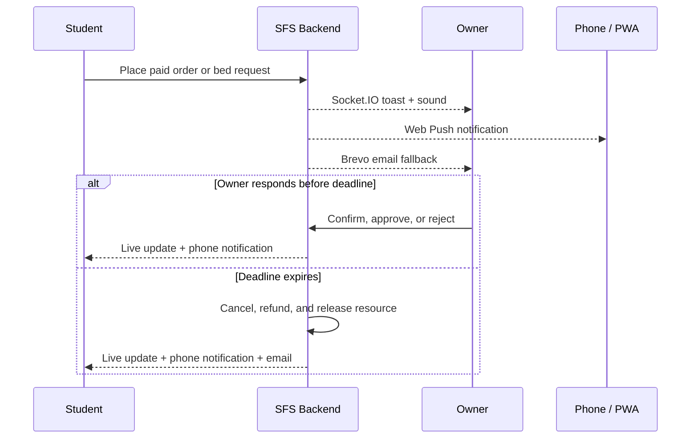
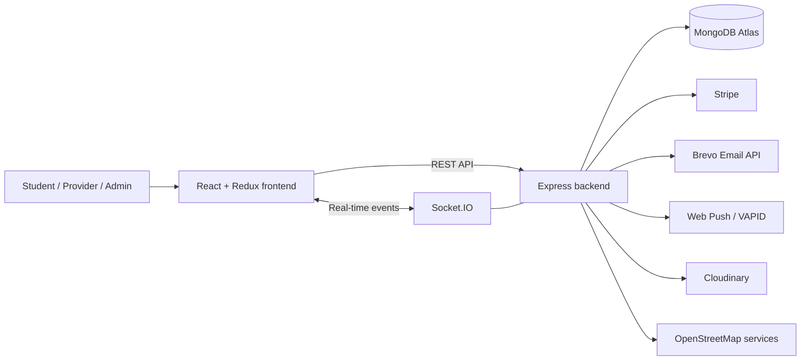

<div align="center">
  

  # Student Facility System

  **One platform for student accommodation, homemade food, bookings, payments, and campus life.**

  [](https://sfs-fyp.vercel.app/)
  [](https://react.dev/)
  [](https://nodejs.org/)
  [](https://www.mongodb.com/atlas)
  [](https://developer.mozilla.org/en-US/docs/Web/Progressive_web_apps)
  [](https://developer.mozilla.org/en-US/docs/Web/API/Push_API)
  [](backend/LICENSE)

  A full-stack final-year project developed by **Aqib Awan (Aqib Ejaz)**<br />
  Govt. Shalimar Graduate College, Lahore
</div>

---

## ✨ What is SFS?

Student Facility System (SFS) brings essential student services into a single responsive web application. Students can discover nearby hostels, order homemade food, complete payments, communicate with providers, and manage their activity. Hostel owners, kitchen owners, and administrators receive dedicated tools for running their side of the platform.

<div align="center">
  <table>
    <tr>
      <td align="center"></td>
      <td align="center"></td>
    </tr>
    <tr>
      <td align="center"><strong>🏠 Hostel discovery and booking</strong></td>
      <td align="center"><strong>🍲 Homemade food ordering</strong></td>
    </tr>
  </table>
</div>

## 🚀 Highlights

| Area | Capabilities |
|---|---|
| 🔐 Authentication | Role-based registration, email OTP verification, login, and password recovery |
| 🏠 Hostels | Search and filter listings, map-based discovery, room/bed availability, and booking management |
| 🍲 Homemade food | Browse kitchens and dishes, manage a cart, place orders, and follow order progress |
| 💳 Payments | Stripe-powered checkout for hostel bookings and food orders |
| 🔔 Reliable alerts | PWA phone push, Socket.IO toast and sound, Brevo email fallback, and status updates |
| ⏱️ Timely responses | Live owner-response countdowns with automatic request expiry and payment refunds |
| 💬 Communication | Real-time Socket.IO chat between students and food providers |
| ⭐ Community | Reviews and ratings for platform services |
| 📍 Location | Leaflet maps, OpenStreetMap data, geocoding, and institute-aware discovery |
| 📄 Receipts | Downloadable PDF invoices and transactional email attachments |
| 🖼️ Media | Cloudinary-backed profile and listing image uploads |
| 🛡️ Administration | Platform statistics, account moderation, listing management, and admin controls |

## 👥 Built for every role

- **Students** — find accommodation and food, book, order, pay, review, and track everything from one profile.
- **Hostel owners** — publish hostels and rooms, manage bed availability, review booking requests, and monitor performance.
- **Kitchen owners** — manage kitchens and dishes, process orders, and track sales activity.
- **Administrators** — oversee users, providers, listings, platform metrics, and account access.

## 🧰 Technology stack

| Layer | Technologies |
|---|---|
| Frontend | React 18, Redux Toolkit, React Router, Tailwind CSS, Recharts |
| Backend | Node.js 20, Express, Socket.IO, JWT, Helmet, Express Rate Limit |
| Data | MongoDB, Mongoose |
| Maps | Leaflet, React Leaflet, OpenStreetMap |
| Payments | Stripe Elements and Stripe API |
| Email | Brevo Transactional Email API |
| Storage | Cloudinary |
| Deployment | Vercel, Render, MongoDB Atlas |

## 🔔 Reliable booking and order alerts

SFS does not require an owner to keep the dashboard open. Once a user installs SFS on their phone and taps **Enable phone alerts**, the application can deliver system notifications while it is open, minimized, or closed.

| Event | Online experience | Away-from-app experience | Response protection |
|---|---|---|---|
| New food order | Instant toast and two-tone alert | PWA phone push and Brevo email | Kitchen has 10 minutes to confirm |
| New hostel request | Instant toast and two-tone alert | PWA phone push and Brevo email | Hostel has 24 hours to decide |
| Owner decision/status | Live Socket.IO update | Phone push and email where applicable | Student always sees the latest state |
| No owner response | Live expiry update | Cancellation notification and email | Payment is refunded and the bed/order is released |

Students and owners see a live countdown for pending requests. A backend expiry worker checks overdue requests every minute. Refund requests use idempotency protection so retrying the worker cannot intentionally create duplicate refunds.



### 📱 Enable notifications on a phone

1. Open the deployed SFS website over HTTPS.
2. Add SFS to the phone's Home Screen.
3. Sign in and tap **Enable phone alerts** in the navigation menu.
4. Select **Allow** when the phone asks for notification permission.

Android supports installed PWA notifications through compatible browsers. On iPhone and iPad, install SFS on the Home Screen and use iOS/iPadOS 16.4 or later.

## 🏗️ Architecture



## 📁 Project structure

```text
sfs/
├── frontend/                 # React single-page application
│   ├── public/               # Static assets, manifest, robots, and sitemap
│   └── src/
│       ├── components/       # Shared and feature components
│       ├── screens/          # Main application pages
│       ├── store/            # Redux slices and store
│       └── utils/            # API, auth, receipt, and notification helpers
├── backend/                  # Express and Socket.IO server
│   ├── controllers/          # Business logic grouped by feature
│   ├── models/               # Mongoose schemas
│   ├── routes/               # API route definitions
│   ├── middlewares/          # Authentication and error handling
│   ├── services/             # Push delivery and request-expiry workers
│   └── utils/                # Email, PDF, upload, and location helpers
└── DEPLOYMENT_GUIDE.md       # Complete production deployment guide
```

## ⚡ Run locally

### Prerequisites

- Node.js 20+
- npm
- MongoDB locally or a MongoDB Atlas connection
- Service credentials for the integrations you want to exercise

### 1. Clone the repository

```bash
git clone https://github.com/aqibawan2003/sfs.git
cd sfs
```

### 2. Start the backend

```bash
cd backend
npm install
```

Copy `backend/.env.example` to `backend/.env`, configure the required values, and run:

```bash
npm run dev
```

The API starts at `http://localhost:5000` by default.

### 3. Start the frontend

Open another terminal:

```bash
cd frontend
npm install
```

Copy `frontend/.env.example` to `frontend/.env`, then run:

```bash
npm start
```

The application opens at `http://localhost:3000`.

## 🔑 Environment configuration

Never commit real credentials. Both applications include safe `.env.example` templates.

### Backend

| Variable | Purpose |
|---|---|
| `MONGODB_URI` | MongoDB connection string |
| `JWT_SECRET` | Secret used to sign authentication tokens |
| `BREVO_API_KEY` | Brevo transactional email API key |
| `BREVO_FROM` | Sender address verified in Brevo |
| `STRIPE_SECRET_KEY` | Stripe server-side secret key |
| `ALLOWED_ORIGIN` | Comma-separated frontend origins allowed by CORS |
| `CLOUDINARY_CLOUD_NAME` | Cloudinary account cloud name |
| `CLOUDINARY_API_KEY` | Cloudinary API key |
| `CLOUDINARY_API_SECRET` | Cloudinary API secret |
| `VAPID_PUBLIC_KEY` | Public VAPID key used to subscribe installed SFS apps to phone notifications |
| `VAPID_PRIVATE_KEY` | Secret VAPID key used by the backend to send phone notifications |
| `VAPID_SUBJECT` | Administrator contact URI, normally `mailto:you@example.com` |
| `ORDER_RESPONSE_MINUTES` | Food-order confirmation window; defaults to `10` minutes |
| `BOOKING_RESPONSE_HOURS` | Hostel-request decision window; defaults to `24` hours |

See [backend/.env.example](backend/.env.example) for optional settings and local-development defaults.

Generate one VAPID key pair for Web Push:

```bash
cd backend
npx web-push generate-vapid-keys
```

Copy the generated public and private keys into local `backend/.env` and the Render backend environment. Keep `VAPID_PRIVATE_KEY` secret, never commit it, and do not regenerate the pair after users subscribe unless you intend to make them subscribe again.

### Frontend

| Variable | Purpose |
|---|---|
| `REACT_APP_API_URL` | Public URL of the backend API |
| `REACT_APP_STRIPE_PUBLIC_KEY` | Stripe publishable key |

See [frontend/.env.example](frontend/.env.example) for the complete template.

## 🧪 Useful commands

| Command | Directory | Purpose |
|---|---|---|
| `npm start` | `frontend` | Start the React development server |
| `npm run build` | `frontend` | Create an optimized production build |
| `npm test` | `frontend` | Run frontend tests |
| `npm run dev` | `backend` | Start the API with Nodemon |
| `npm start` | `backend` | Start the production API |
| `npm test` | `backend` | Run backend tests with Jest |

## 🌐 Deployment

The production architecture uses:

- **Frontend:** Vercel
- **Backend:** Render
- **Database:** MongoDB Atlas
- **Transactional email:** Brevo

Read the [complete deployment guide](DEPLOYMENT_GUIDE.md) for environment configuration, service setup, and production deployment.

## 🔒 Security notes

- JWT-protected routes and role-aware authorization
- Password hashing with bcrypt
- Security headers through Helmet
- Rate limiting on general and authentication endpoints
- Server-side validation for sensitive requests
- Secrets excluded from source control through `.gitignore`

If a secret is ever exposed, revoke it at the provider, generate a replacement, and update the deployment environment immediately.

## 👨‍💻 Project team

<div align="center">

| Project author | Team members |
|---|---|
| **Aqib Awan (Aqib Ejaz)** | **Abubakr Bhatti** · **M. Sami** |

**Govt. Shalimar Graduate College, Lahore**

</div>

## 🤝 Contributing

Contributions and suggestions are welcome:

1. Fork the repository.
2. Create a feature branch: `git checkout -b feature/your-feature`.
3. Commit your changes: `git commit -m "Add your feature"`.
4. Push the branch: `git push origin feature/your-feature`.
5. Open a pull request.

## 📜 License

This project is available under the [MIT License](backend/LICENSE).

---

<div align="center">
  Built with care for students by <strong>Aqib Awan</strong> 💚
  <br />
  <a href="https://sfs-fyp.vercel.app/">Live application</a>
  ·
  <a href="DEPLOYMENT_GUIDE.md">Deployment guide</a>
</div>
